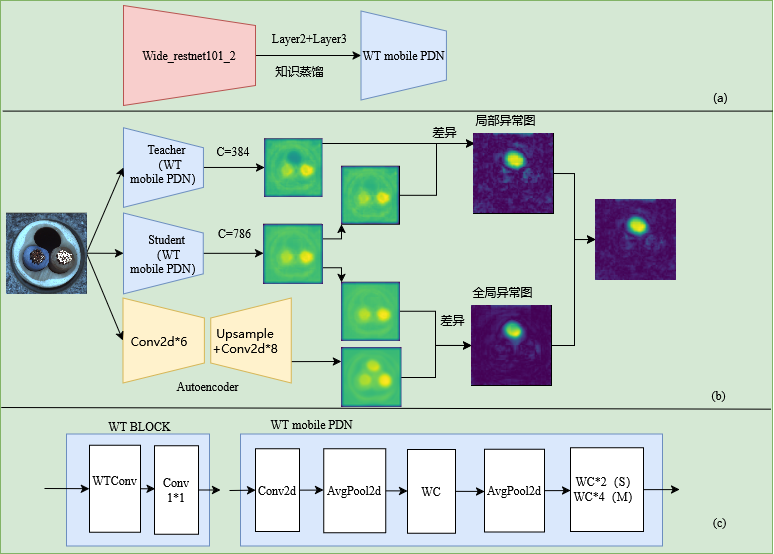
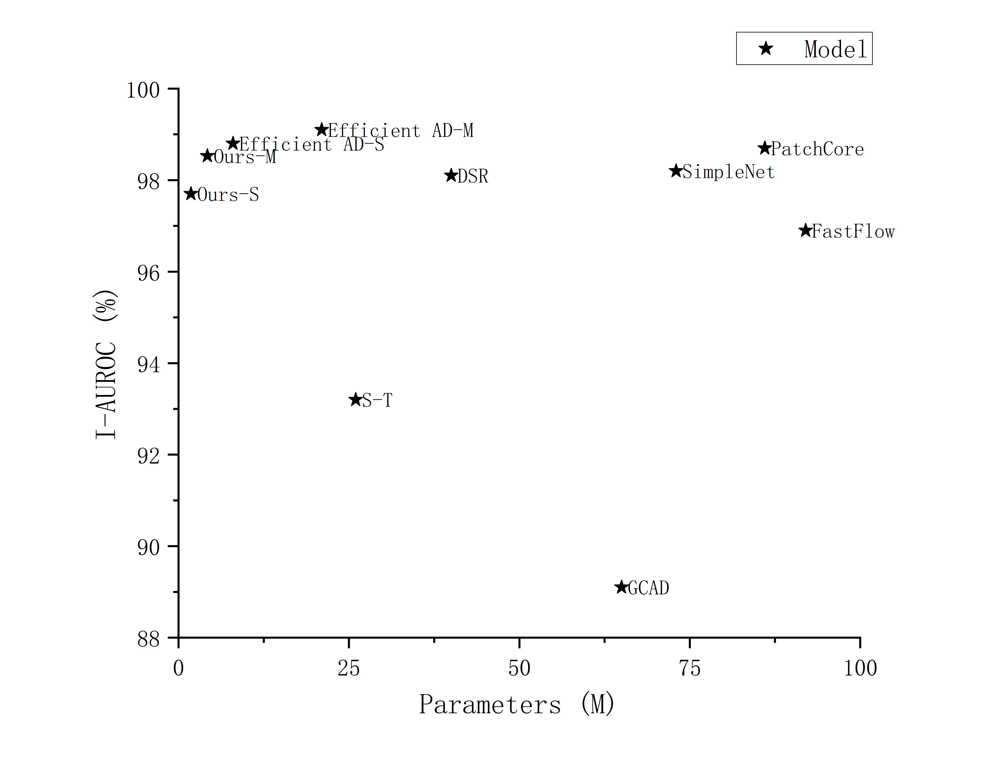

# WTmobilePDN
##

 

 
 ##
 


## Results

| Model         | Dataset    | Official Paper | efficientad.py |our(AU-ROC,params)  |  
|---------------|------------|----------------|----------------|--------------------|
| EfficientAD-M | Mvtec AD   | 99.1%,20.74M           | 98.94          |98.53%,4.23M|  
| EfficientAD-S | Mvtec AD   | 98.8%, 8.06M           | 98.89          |97.68%,1.82M| 

### Packages

```
PyWavelets==1.6.0
Python==3.10
torch==1.13.0
torchvision==0.14.0
tifffile==2021.7.30
tqdm==4.56.0
scikit-learn==1.2.2
numpy==1.18.5
Pillow==7.0.0
scipy==1.7.1
tabulate==0.8.7
tifffile==2021.7.30
tqdm==4.56.0
```

### Mvtec AD Dataset,ImageNet

For Mvtec evaluation code install:

Download dataset (if you already have downloaded then set path to dataset (`--mvtec_ad_path`) when calling `efficientad.py`).
```
mkdir mvtec_anomaly_detection
cd mvtec_anomaly_detection
wget https://www.mydrive.ch/shares/38536/3830184030e49fe74747669442f0f282/download/420938113-1629952094/mvtec_anomaly_detection.tar.xz
tar -xvf mvtec_anomaly_detection.tar.xz
cd ..
```
## Knowledge distillation
You need to distill the model yourself，In that case, download the ImageNet (ILSVRC2012) dataset from the link below:
https://www.image-net.org/download.php
We also provide mesoscale (C+WT*5) distillation models in the A catalog.

## efficientad.py

Training and inference:

```
trian.sh
```

Evaluation with Mvtec evaluation code:

```
eval.sh
```

## Acknowledgements
Thanks for the great inspiration from Efficient AD.
## License
This project is licensed under the Apache-2.0 License.
